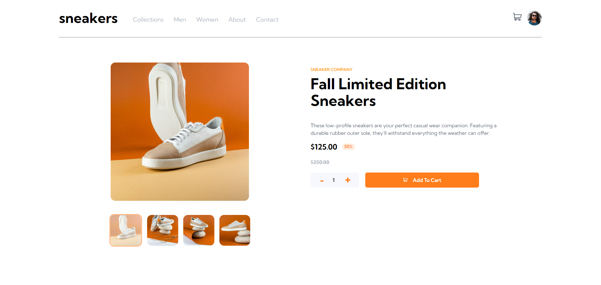
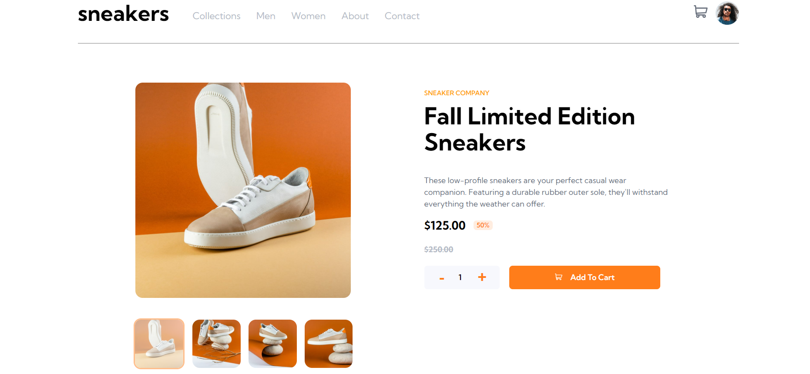

# Frontend Mentor - E-commerce product page solution

This is a solution to the [E-commerce product page challenge on Frontend Mentor](https://www.frontendmentor.io/challenges/ecommerce-product-page-UPsZ9MJp6). Frontend Mentor challenges help you improve your coding skills by building realistic projects.

## Table of contents

- [Overview](#overview)
  - [The challenge](#the-challenge)
  - [Screenshot](#screenshot)
  - [Links](#links)
- [My process](#my-process)
  - [Built with](#built-with)
  - [What I learned](#what-i-learned)
  - [Continued development](#continued-development)
  - [Useful resources](#useful-resources)
- [Author](#author)
- [Acknowledgments](#acknowledgments)

**Note: Delete this note and update the table of contents based on what sections you keep.**

## Overview

### The challenge

Users should be able to:

- View the optimal layout for the site depending on their device's screen size
- See hover states for all interactive elements on the page
- Open a lightbox gallery by clicking on the large product image
- Switch the large product image by clicking on the small thumbnail images
- Add items to the cart
- View the cart and remove items from it

### Screenshot





### Links

- Solution URL: [Frontend Mentor - Ecommerce Solution](https://www.frontendmentor.io/solutions/ecommerce-made-with-react-and-css-ZZlUOdpHei)
- Live Site URL: [Live website](https://eccomerce-teal.vercel.app/)

## My process

### Built with

- Semantic HTML5 markup
- CSS custom properties
- Flexbox
- CSS Grid
- [React](https://reactjs.org/) - JS library

### What I learned

I had some issues figuring out how to remove items but the solution was easier that I thought, just using the splice method I can delete an specific element of the items array.

You can check it out here:

```js
function handleRemoveItem(id) {
  setCartItems((prevItems) => {
    const updatedItems = [...prevItems.items];

    const existingCartItemIndex = updatedItems.findIndex(
      (cartItem) => cartItem.id === id
    );

    const existingCartItem = updatedItems[existingCartItemIndex];

    console.log(existingCartItemIndex);

    if (existingCartItem) {
      updatedItems.splice(existingCartItemIndex, 1);
    }

    return {
      items: updatedItems,
    };
  });
}
```

### Continued development

I would like to improve my hooks usage when using React in general. I've heard it's pretty normal that at the beginning you will try to solve everything with state and I feel that was my case for this project until I look for more options on internet on how to accomplish some things.

### Useful resources

- [MDN](https://developer.mozilla.org/es/) - Great to have interactive explanations of how code works.
- [W3schools](https://www.w3schools.com/) - I use one this pretty often if MDN wasn't too clear for me.

## Author

- Website - [Jose Ávila](https://github.com/javila26)
- Frontend Mentor - [@javila26](https://www.frontendmentor.io/profile/javila26)

## Acknowledgments

Thanks to all the people who tested my app when I asked them to.
